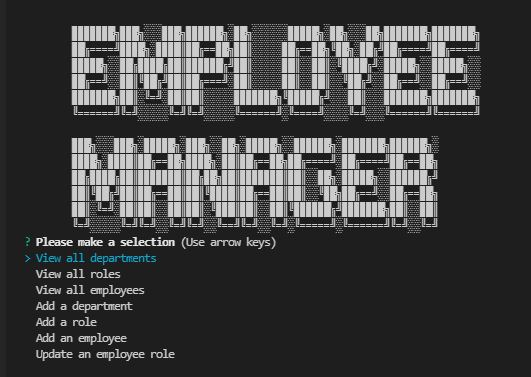
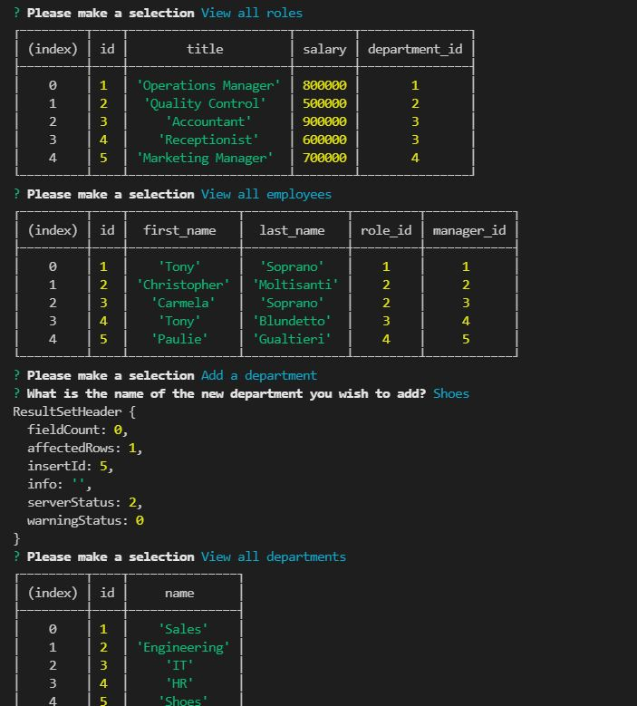
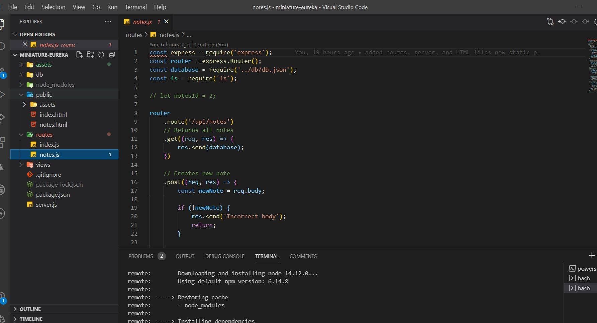
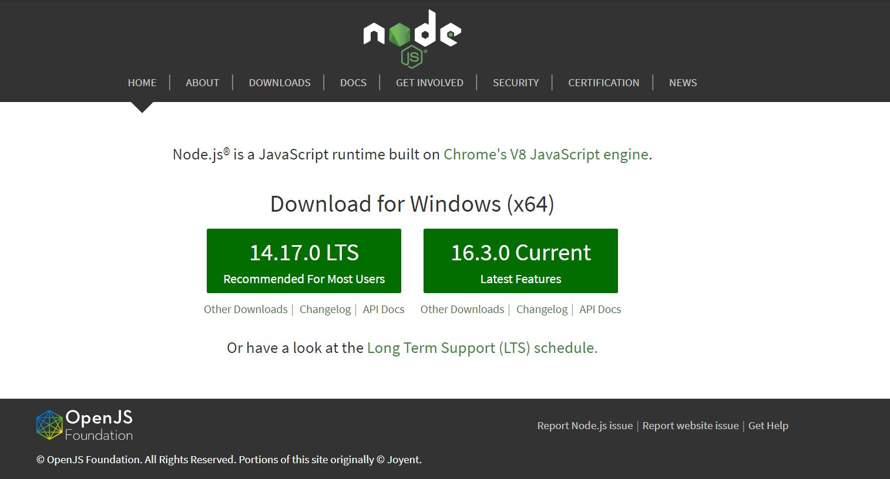
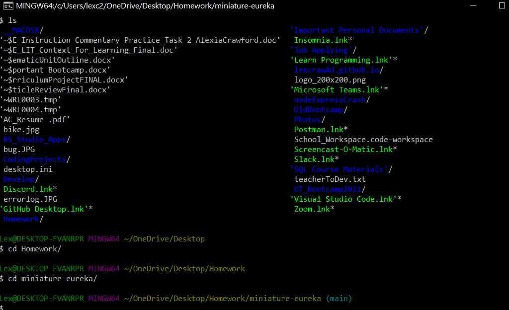

# Employee Tracker

#### Table of Contents

- [About](#About)
- [Installation](#Installation)
- [Usage](#Usage)
- [Contribution](#Contribution)
- [License](#License)

# About

The Employee Tracker Application was designed to allow business owner's to run the command line interface to view and manage departments, roles, and employees within their company so they can better organize and plan their business . 
The user is able to track their employees by: department, role, and employees.
The Employee Tracker App was created using [Visual Studio Code](https://code.visualstudio.com/), [Node.js](https://nodejs.org/en/),[Node Package Manager (npm)](https://www.npmjs.com/), [mySQL](https://www.mysql.com/) and [Express](https://expressjs.com/).
Please visit [this video](https://drive.google.com/file/d/18LElEEGNcdh0U_lq7Psx63QmiKYT7guF/view?usp=sharing) for a live demonstration, since the Employee Tracker is  is made via the command line.

# Installation

To install please visit [my repository](https://github.com/lexcraw4d/employeeTracker) and look at the uploaded files via GitHub Deployment. You may fork my repository and download [Node.js](https://nodejs.org/en/) Additionally, you will need [Visual Studio Code](https://code.visualstudio.com/), [npm](https://www.npmjs.com/), and [Express](https://www.npmjs.com/package/express).The details of how to implement these are provided in the [Usage](#Usage) section below.

# Usage

!

##### Visual Studio Code

Visual Studio Code (VS) was used to create, edit, and code the Team Profile Generator.

[Visual Studio Code](https://code.visualstudio.com/) is an lightning fast FREE open-source editor designed by [Microsoft](https://www.microsoft.com/en-us/) with developers in mind. Visual Studio code allows developers to easily apply the edit-build-debug cycle, resulting in more productivity on your ideas.

[Visual Studio Code](https://code.visualstudio.com/) brings all that you need as a developer, such as: debugging, instant editing results, customization specifically designed for your preference, hundreds of languages, extensions, version control, and more all at your fingertips!

### Node.js

Node.js was used in combination with VSC. Node.js allows the user to interact with the command line interface instead of the window object. You can download Node [here](https://nodejs.org/en/).

### npm and Express
[npm](https://www.npmjs.com/package/inquirer) was used in combination with [Express](https://expressjs.com/) to create a backend middleware server. Express is a flexible Node.js application frameworke that provides many features available for both mobile and the web. Please click the referenced information for documentation on npm and Express.

### Directions

To run the Employee Tracker please fork my repository and open your CLI terminal. Run the index.js and you will be prompted with the questions for your own employee database.

✨Wahlah! That's it!✨
Always keep track of your employees, departments, and roles ot better plan your business! ✅🔥

#### GitHub/Git

In order to make effective changes to the website both [Git](https://gitforwindows.org/) and [GitHub](https://github.com/) were used in synchronization to push commits of the latest updated version.

Git is version control system which allows multiple users to make changes to one single repository.

GitHub is a corporation which provides hosting for version control using Git and software development. [GitHub Docs ](https://docs.github.com/en/free-pro-team@latest/github/setting-up-and-managing-your-github-user-account/managing-user-account-settings) provides all needs for setting up your GitHub and answering problem-solving issues you may come across while using GitHub.

# Contribution

Feel free to contribute to this project in any of the following ways:

- [Submit bug and feature requests](https://github.com/lexcraw4d/employeeTracker/issues)
- [Review Source Code Changes](https://github.com/lexcraw4d/employeeTracker/pulls) and make pull requests from typos to content
- For specific concerns that do not meet the above please do not hesitate to reach out to me via [My GitHub](https://github.com/lexcraw4d).

If you are interested in fixing issues directly to the code base, please reference the [How to Contribute](https://github.com/microsoft/vscode/wiki/How-to-Contribute) article.

# License

This source code is available to everyone under the standard [MIT License](https://github.com/microsoft/vscode/blob/master/LICENSE.txt).

:copyright: 2021 Lexie Crawford :computer: :heart:
